# 1. Login Page

The login page is the entry point for users to access the digital signing service (DSS). It is designed to provide a secure and seamless login experience.

## 1.1. Security

The login page is secured using industry-standard encryption protocols to protect user credentials and data.

### 1.1.1. Login Credentials

Users can log in using their registered email address and password, which are securely stored and encrypted. The user will need to agree to the terms and conditions to proceed, by ticking on the relevant check box.

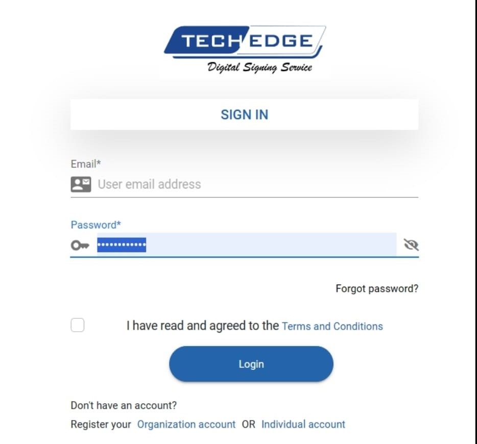

### 1.1.2. Two-factor Authentication Option

For enhanced security, account administrators have the option to enable two-factor authentication (2FA), which sends a verification code to the registered email.

### 1.1.3. Password Reset

Users can reset their password using a secure and straightforward process.

#### The user requesting the password reset clicks on the “Reset password” link

.jpeg)
.jpeg)

# 2. Home Page

The home page serves as the main dashboard for users, providing quick access to essential features and information.

## 2.1. Left-side Panel

The left-side panel displays navigation options, allowing users to easily switch between different sections of the digital signing service.

### 2.1.1. Avatar

Users can personalize their account by uploading an avatar image, which is displayed on the top-left side of the home page.

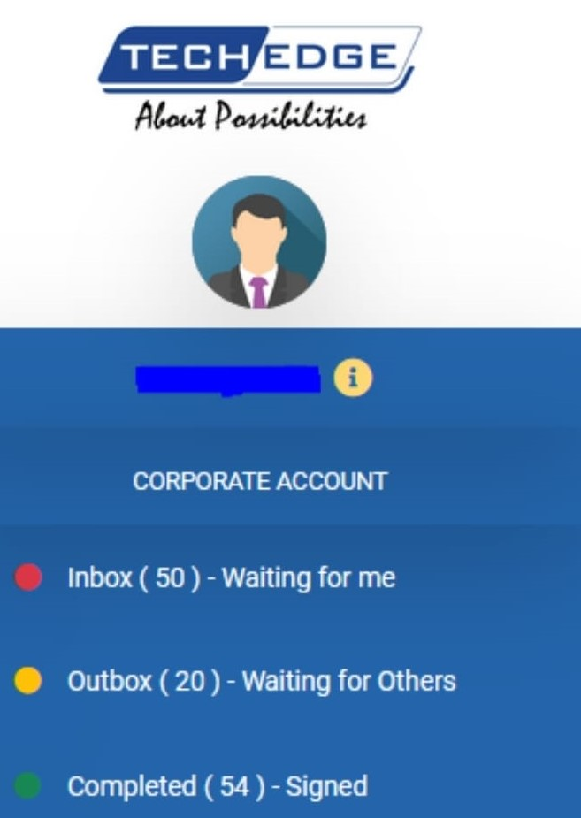

### More Info

The 'more info' icon represented by the yellow ‘i’ symbol provides additional information or context for specific features or sections of the digital signing service.

### 2.1.2. Sign Out

Users can securely sign out of their account to protect their privacy and data. This can be done by pressing the sign-out button.

## 2.2. Document Upload Panel

The upload document panel allows users to upload documents for digital signing.

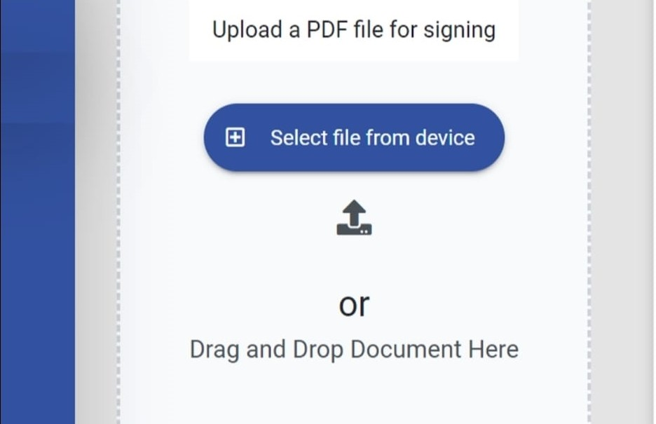

## 2.3. Filters Panel (right-side)

The right-side panel has filters that allow the user to switch between different tabs, these being Inbox, Outbox, Complete, Voided, and Saved for Later.

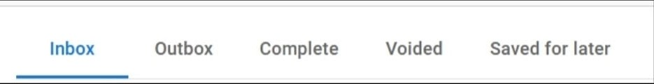

### 2.3.1. Inbox

The inbox displays documents initiated by other parties that require the logged-in user's signature. The user can sign a document, preview it, or view more details.

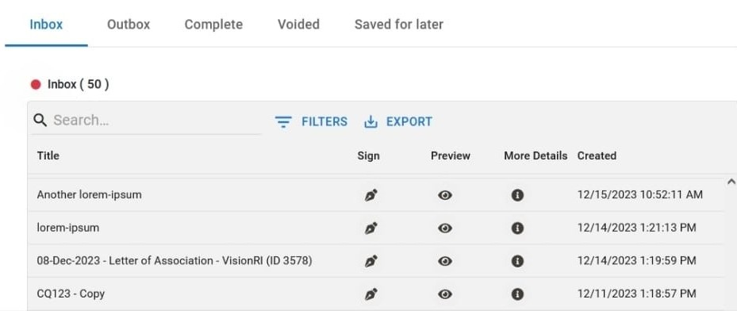

### 2.3.2. Outbox

The outbox displays documents which the current user has initiated for other parties to sign. The user can preview a document or view more details.

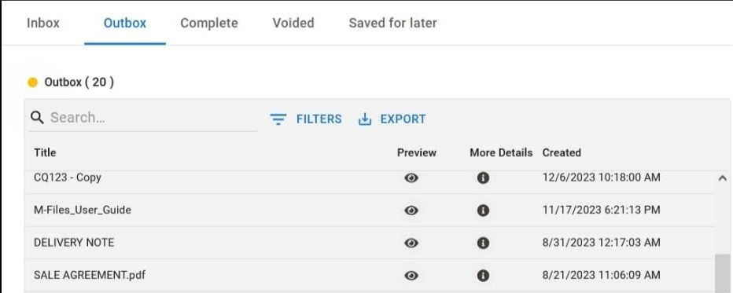

### 2.3.3. Complete

The complete section lists successfully signed documents that are relevant to the currently logged-in user. The user can preview a document or view more details.

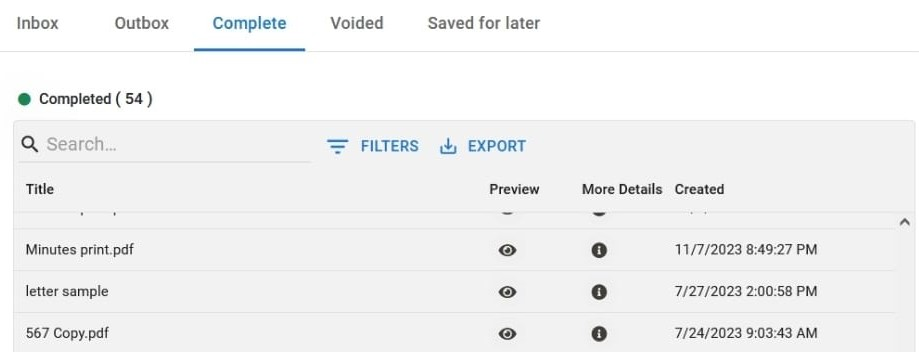

### 2.3.4. Voided

The voided section displays documents that have been canceled or invalidated, either by the current user or by other signers. Users are able to preview the document and view more details.

### 2.3.5. Saved for Later

Users can save documents for later action by themselves, other signers, or both. The user is able to sign the document, add other signers, preview, and view more details.

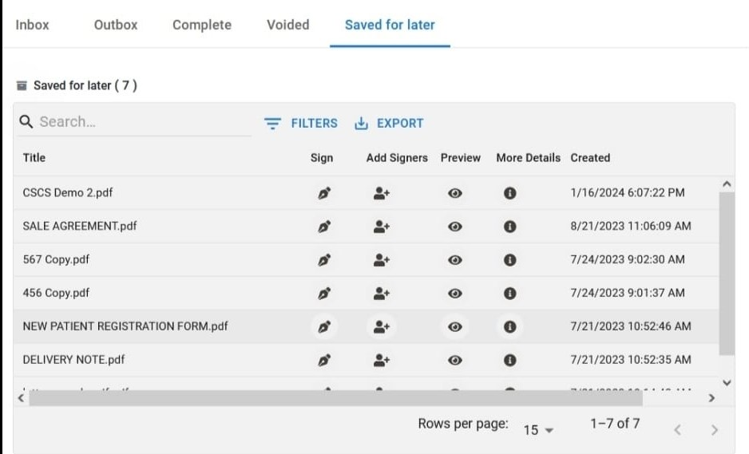

# 3. Document Signing Process

## The first step in the signing process is a user uploading a document.

This is done from the document upload panel at the center of the home page. Users can drag-drop PDF documents onto the upload pane, or select one from their computers.

.jpeg)
.jpeg)

### 3.1. ‘I want to sign myself now’

This option sends the user directly to the signing page.

### 3.2. ‘I want to send to others to sign’

This option sends the user to a page that allows them to send the document to other parties for signing, without having to sign themselves.

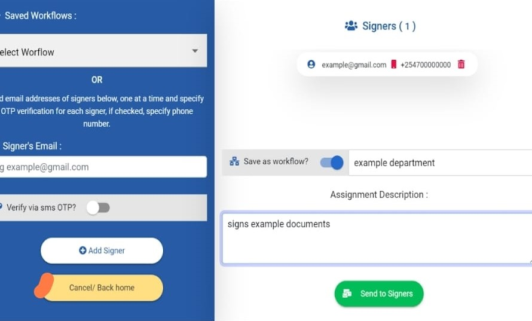

### 3.3. ‘I want to save for later’

This option sends the document to the ‘Saved for Later – Unsigned’ tab.

### 3.4. ‘I want to cancel and upload again’

This option directs the user to the home page.

## 3.2. Signing a document initiated by another party

When a document is sent to a third-party for signing, the third-party signer receives the signing request via email.

## 3.3. The Signing Process

Once on the signing page, the signer is presented with a number of options;

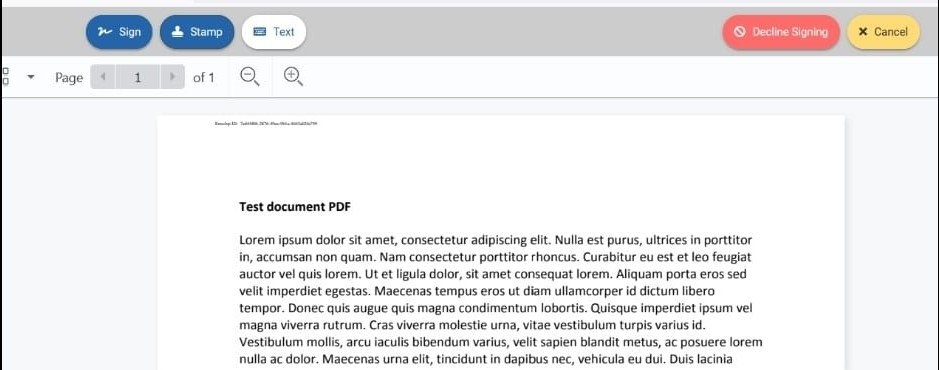

### 3.3.1. Sign

This button presents the user with two options;

#### 3.3.1.1. Sign on current page

This option allows the user to place their signature only on the page they’re currently on.

.jpeg)
.jpeg)

#### 3.3.1.2. Sign on all pages

This option works almost exactly like the ‘Sign on current page’ option, with the only difference being that the placed signature will appear on the same position across all pages of the document.

### 3.3.2. Stamp

The user has the option to place a stamp on the document. The stamp works similar to the ‘Sign’ function, except that it only allows the user to upload an image of a stamp or select from a list of saved stamps.

### 3.3.3. Text

The DSS allows the user to place text annotations on the document and position them accordingly using their cursor. They can modify the font of the text.

### 3.3.4. Decline Signing

Should the signer not wish to sign the document as requested, they have the option to ‘Decline Signing’. Upon clicking this button, the user is presented with a dialogue box requesting them to add their reason for voiding the process.

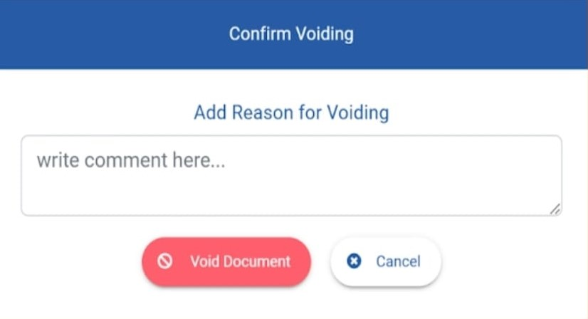

### 3.3.5. Final Signed Document & Signing Report

Once the signing process is done, both the initiator and all the signers will receive an email informing them that signing is successful. Attached to this email will be a copy of the signed document as well as a signing report.

# 4. Admin Dashboard

The admin dashboard is a centralized hub for administrators to manage user accounts, settings, and integrations.

## 4.1. Creating New User Account

Administrators can create new user accounts, assign roles, and manage permissions. This can be done by clicking on the ‘Create user’ button on the admin dashboard. The admin will then add the user’s details and submit.

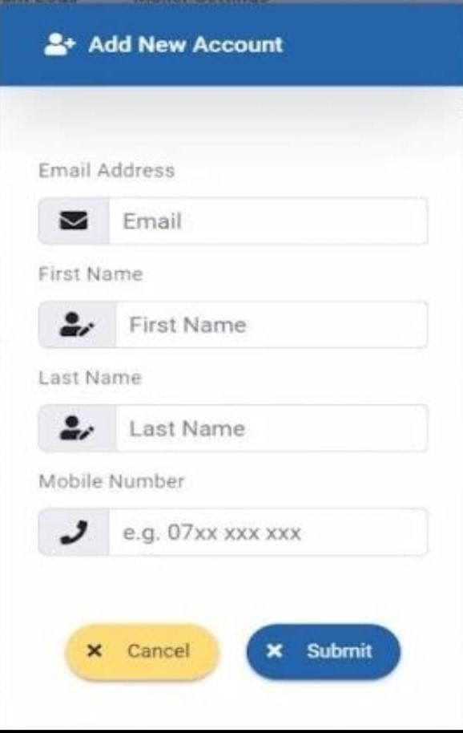

### 4.1.1. Change Organization Logo

Administrators can customize the front-end of the DSS by uploading the organization's logo. This can be done by clicking on the ‘Change logo’ option on the admin dashboard.

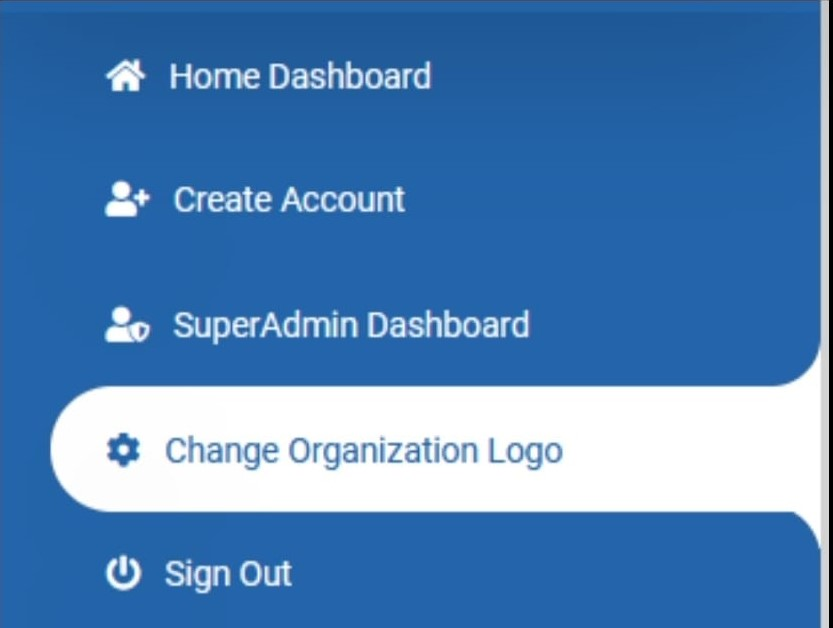

### 4.1.2. System Logs

The system logs provide a detailed log of user activity. The logs can be filtered and exported as the case may apply.

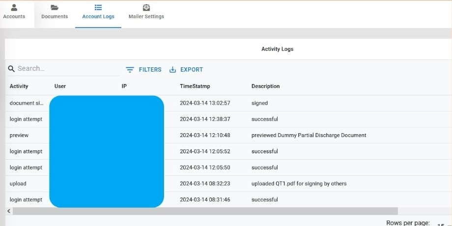

### 4.1.3. Mailer Settings

Administrators can configure email settings, such as SMTP server details, for sending notifications and alerts.

### 4.1.4. Integrations

The digital signing service supports integrations with third-party systems, providing flexibility and interoperability. The service provides an SDK which developers can leverage for such integrations.

# 5. FAQs

- Where is the DSS hosted?
  A: The DSS is hosted on Microsoft’s Azure Cloud.

- Can a user upload multiple documents at a time?
  A: This is a feature currently under development and is scheduled for release soon.
